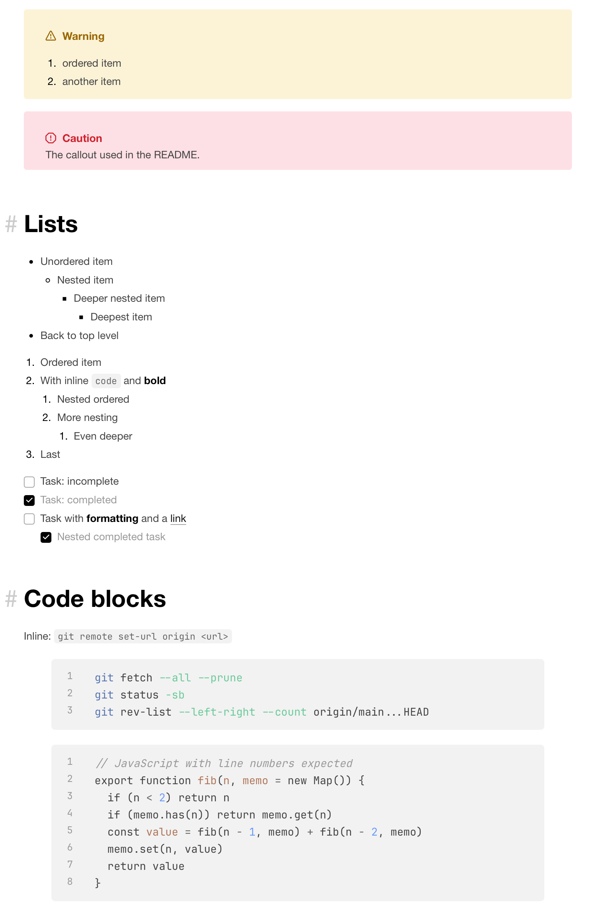
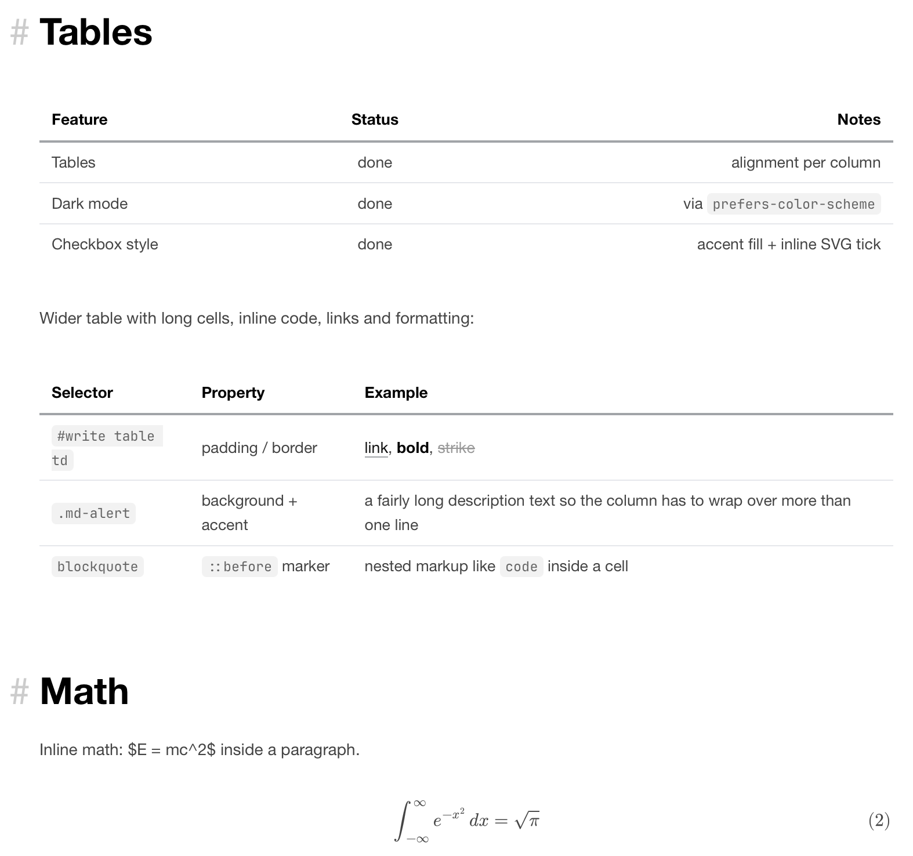
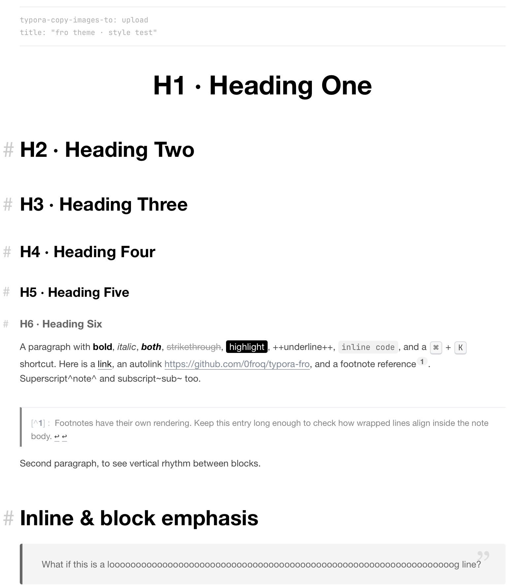

# typora-fro

  
  
  
  

A Typora theme in the spirit of [VitePress](https://vitepress.dev/)'s default look. Light first, with a dark scheme that follows your system appearance.

> [!NOTE]
> **On the two-year silence.** This theme sat untouched after 2024 for two reasons: I stopped using Typora day-to-day, and I moved to a new GitHub account ([@0froq](https://github.com/0froq)), leaving the old one behind. While migrating repos I found this one had picked up a dozen or so stars — genuinely flattering, and sorry for the silence that followed.
>
> It is now under maintenance again, with releases and a [changelog](CHANGELOG.md). I probably won't chase Typora updates the way an active project would, but Typora's theme hooks are stable CSS selectors, so a theme that works today tends to keep working. Issues are the fastest way to reach me: open one and I'll actually respond.

## What's in it

- **Dark mode** that follows the system appearance — no setting to remember, and native controls (scrollbars, form fields, tooltips) flip with it.
- **Code highlighting** built on the palette of [lig.nvim](https://github.com/0froq/lig.nvim) and [LiG for Code](https://github.com/0froq/vscode-theme-LiG): colour for structure, actions and references only, so keywords and identifiers stay out of the way. Separate ramps for light, dark and print.
- Callouts, task lists, footnotes, tables, math, diagrams, source code mode, the sidebar — all painted, all from one set of tokens.
- No remote fonts or icon fonts. The theme renders offline.

`style-test.md` in this repo exercises every element above — the quickest way to see what a release covers, or to check a change of your own.

> [!CAUTION]
> Designed and tested on macOS. It should work on Windows and Linux, but I have not re-tested either since the rewrite — open an issue if something looks off there.

## Screenshot

## Installation

1. Grab the latest release from [releases](https://github.com/0froq/typora-fro/releases/) — or clone/download the repo.
2. In Typora, go to `Settings...` → `Appearance` → `Open Theme Folder`.
3. Copy `fro.css` into that folder.
4. Restart Typora — theme files are read at launch, not when they change on disk.
5. Choose `fro` under `Appearance`.

Dark mode needs nothing extra: it follows the system appearance.

## Changes

See [CHANGELOG.md](CHANGELOG.md). Current release: [v0.1.0](https://github.com/0froq/typora-fro/releases/tag/v0.1.0).

## About

The 2024 original took its style from my [blog](https://fro-blo.com) as it looked then. The blog has since been rewritten and no longer resembles this theme — so don't go there expecting a match; what you see in the screenshots is what the theme is now.

Feel free to report bugs and tell me your ideas about the design.

I also maintain a theme for Obsidian, [Qlean](https://github.com/0froq/Qlean). It doesn't share this theme's design, but you're welcome to look if Obsidian is also in your pencil-box.

## Contact

Email: [sayhola@froq.me](mailto:sayhola@froq.me)
GitHub: [@0froq](https://github.com/0froq)

## Star History

## License

Released under the [MIT License](LICENSE).
