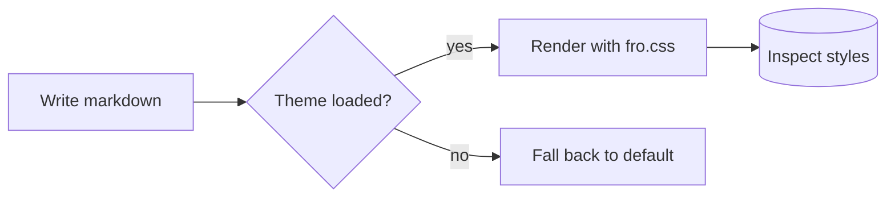
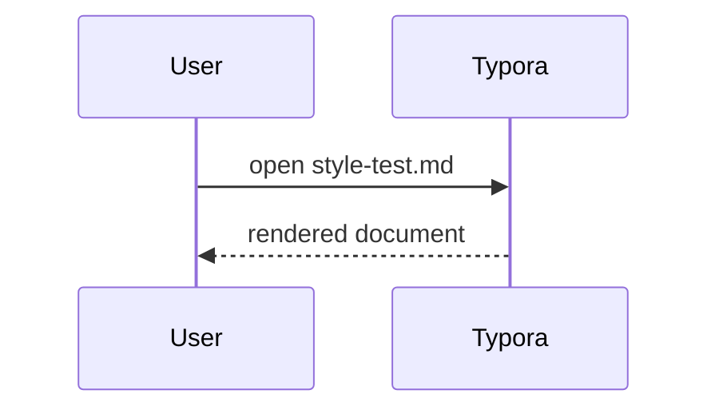

# H1 · Heading One

## H2 · Heading Two

### H3 · Heading Three

#### H4 · Heading Four

##### H5 · Heading Five

###### H6 · Heading Six

A paragraph with **bold**, *italic*, ***both***, ~~strikethrough~~, ==highlight==, <u>underline</u> (`++text++` is not Typora syntax), `inline code`, and a <kbd>⌘</kbd> + <kbd>K</kbd> shortcut. Here is a [link](https://fro-blo.com), an autolink <https://github.com/0froq/typora-fro>, and a footnote reference[^1]. Superscript^note^ and subscript~sub~ too.

[^1]: Footnotes have their own rendering. Keep this entry long enough to check how wrapped lines align inside the note body.

Second paragraph, to see vertical rhythm between blocks.

## Inline & block emphasis

> What if this is a looooooooooooooooooooooooooooooooooooooooooooooooooooooooooooooooog line?

> A blockquote with a paragraph.
>
> ```js
> const inside = 'blockquote code block'
> ```
>
> - list inside a quote
>
> > Nested blockquote, second level.
> >
> > > Third level.

## Callouts

> [!note]
> A note callout with a title on its own line.

> [!tip] 
> Body text with `code` and a [link](#h2--heading-two).

> [!important]
> Multi-line body.
> Second line of the same callout.

> [!warning] 
>
> 1. ordered item
> 2. another item

> [!caution]
> The callout used in the README.

## Lists

- Unordered item
  - Nested item
    - Deeper nested item
      - Deepest item
- Back to top level

1. Ordered item
2. With inline `code` and **bold**
   1. Nested ordered
   2. More nesting
       1. Even deeper
3. Last

- [ ] Task: incomplete
- [x] Task: completed
- [ ] Task with **formatting** and a [link](https://example.com)
  - [x] Nested completed task

## Code blocks

Inline: `git remote set-url origin <url>`

```bash
git fetch --all --prune
git status -sb
git rev-list --left-right --count origin/main...HEAD
```

```js
// JavaScript with line numbers expected
export function fib(n, memo = new Map()) {
  if (n < 2) return n
  if (memo.has(n)) return memo.get(n)
  const value = fib(n - 1, memo) + fib(n - 2, memo)
  memo.set(n, value)
  return value
}
```

```ts
interface Theme {
  name: 'fro'
  mode: 'light' | 'dark'
  apply(el: HTMLElement): void
}
```

```python
def greet(name: str) -> str:
    """Docstring."""
    return f"hello {name}"
```

```json
{
  "name": "typora-fro",
  "version": "0.1.0-beta",
  "private": false
}
```

```css
#write table th {
  font-weight: 600;
  text-align: left;
}
```

```html
<!-- tag / attribute / string / meta roles -->
<figure class="md-image" data-index="1" hidden>
  
  <?php echo 'directive marker'; ?>
</figure>
```

```js
// one fence per palette role: def, builtin, regexp, number, string, comment
const MAX = 12
class Renderer extends Base {
  static async draw(@decorated node, sel = 'li > a') {
    const re = /^(\d+)\.(\d+)\.\d+$/gm
    return node.querySelectorAll(sel).length > MAX ? null : this
  }
}
// https://example.com/url-inside-a-comment
```

```markdown
## Raw markdown inside a fence

- should not be rendered
- just highlighted
```

```
no language specified — plain text block
```

Long lines to test horizontal scrolling:

```bash
echo "aaaaaaaaaaaaaaaaaaaaaaaaaaaaaaaaaaaaaaaaaaaaaaaaaaaaaaaaaaaaaaaaaaaaaaaaaaaaaaaaaaaaaaaaaaaaaaaaaaaaaaaaaaaaaaaaaaaaaaaaaaaaaaaaaaaaaaaaaaaaaaaaaaaaaaaaaaaa"
```

## Tables

| Feature | Status | Notes |
| --- | :-: | --: |
| Tables | done | alignment per column |
| Dark mode | done | via `prefers-color-scheme` |
| Checkbox style | done | accent fill + inline SVG tick |

Wider table with long cells, inline code, links and formatting:

| Selector | Property | Example |
| --- | --- | --- |
| `#write table td` | padding / border | [link](https://example.com), **bold**, ~~strike~~ |
| `.md-alert` | background + accent | a fairly long description text so the column has to wrap over more than one line |
| `blockquote` | `::before` marker | nested markup like `code` inside a cell |

## Math

Inline math: $E = mc^2$ inside a paragraph.

$$
\int_{-\infty}^{\infty} e^{-x^2}\,dx = \sqrt{\pi}
$$

## Diagrams





## Images & figures

Images get an outline plus a drop shadow, so a white screenshot should still read as a
rectangle on the dark background.


An inline image mid-sentence  to check whether the shadow is too heavy for one-line images.

<div align="center">
  
</div>
Typora has no caption syntax for images — `` only feeds a tooltip.
The only route is inline HTML, and it renders only with 偏好设置 → Markdown → HTML →
“渲染 HTML 标签” turned on:

<figure>
  
  <figcaption>Figure 1 — figcaption styling (needs 渲染 HTML 标签)</figcaption>
</figure>

## HTML & misc

<details>
<summary>Click to expand (details / summary)</summary>

Content hidden inside a `<details>` block, including a list:

- item one
- item two

</details>

<table>
  <tr><th>Raw HTML table</th><th>Second col</th></tr>
  <tr><td>row</td><td>value</td></tr>
</table>

Text with <span style="color:#2f6feb">inline styled span</span> and an HTML comment: <!-- painted with .md-comment, not hidden -->.

---

Horizontal rules above and below.

***

## Typora-specific

[TOC]

%% This is a Typora comment (hidden). Should not be visible. %%

<kbd>Ctrl</kbd> + <kbd>Shift</kbd> + <kbd>K</kbd>

Footnotes: second reference[^1] in the paragraph.

[^long]: Another footnote with multiple blocks.

    ```js
    // code block inside a footnote
    const x = 1
    ```
